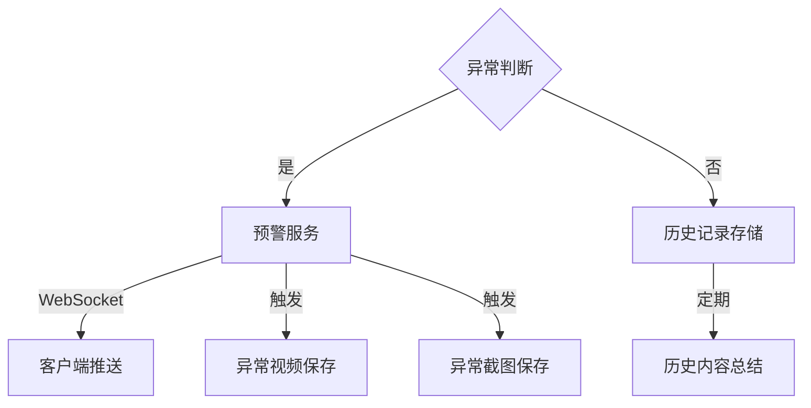
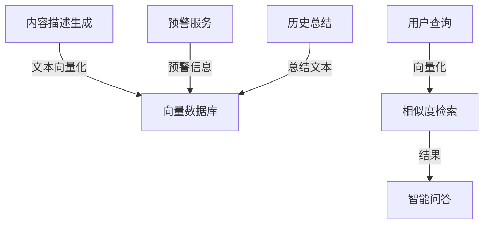

[English](readme_en.md) | 中文

# 智能视频监控预警系统

## 项目概述

本项目是一个基于多模态视觉模型的智能视频监控预警系统。系统能够实时分析监控视频画面，自动检测异常行为并生成预警信息。通过结合视频处理、异常检测和实时预警推送等技术，为安防监控提供智能化解决方案。
同时支持自定义的提示词，可以覆盖不同场景的异常情况。

## 系统流程

### 1. 视频处理流程


### 2. 预警服务流程


### 3. RAG系统流程（可选）


## 主要功能

1. **实时视频分析**
   - 支持本地视频文件和RTSP视频流
   - 自动分析视频内容并生成场景描述

2. **异常行为检测**
   - 智能识别可疑行为和异常情况
   - 实时生成预警信息

3. **实时预警推送**
   - 通过WebSocket推送预警信息
   - 支持视频流实时推送

4. **异常记录存档**
   - 自动保存异常视频片段
   - 记录详细的异常描述

## 使用说明

### 1. 环境配置

```bash
# 安装必要的Python库
pip install -r requirements.txt

```
配置config.py中的参数，包括qwen-vl和语言模型的api地址和API_KEY等
修改提示词，提示词需要根据实际场景进行修改


### 2. 运行系统

```bash
# 使用本地视频文件
python video_server.py --video_source "./测试视频/xxx.mp4"

# 或使用RTSP视频流
python video_server.py --video_source "rtsp://xxx.xxx.xxx.xxx/xxx"
```

### 3. WebSocket推送服务访问

- 预警消息WebSocket：`ws://localhost:16532/alerts`
- 视频流WebSocket：`ws://localhost:16532/video_feed`

### 4. 输出文件

- 异常视频片段：`video_warning/`目录
- 视频内容描述：`video_histroy_info.txt`
- 系统日志：`code.log`

## RAG知识库配置（可选）

如需启用RAG本地知识库功能，需要：

1. 安装向量数据库（如Milvus）
2. 配置数据库连接
3. 配置数据库插入api等
3. 修改系统配置，启用RAG模式
4. 测试utils.py中的insert_txt插入代码

启用后，视频内容描述将存储在向量数据库中，支持智能问答功能。

注意：本开源版本仅包含智能监控报警的核心功能，RAG知识库和大模型api需要自行配置。