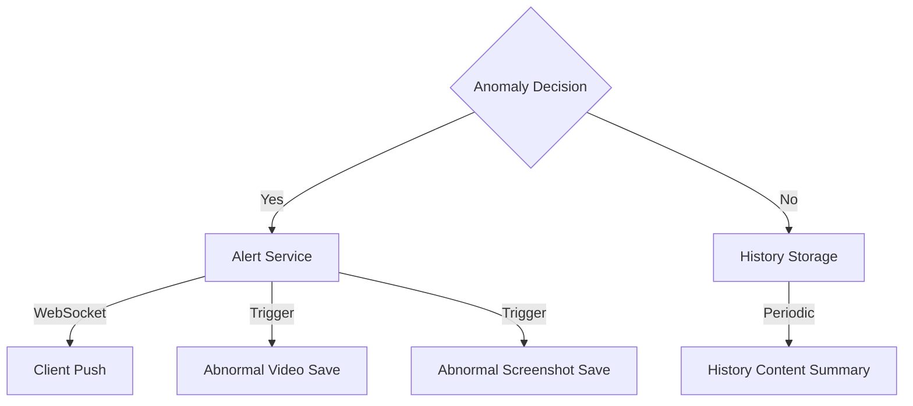
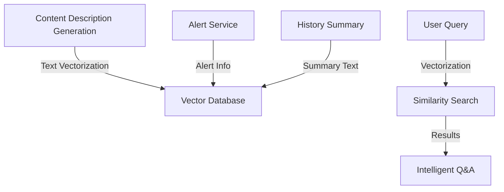

[中文](readme.md) | English

# Intelligent Video Surveillance Alert System

## Project Overview

This project is an intelligent video surveillance alert system based on multimodal vision models. The system can analyze surveillance video footage in real-time, automatically detect abnormal behaviors, and generate alert information. By combining video processing, anomaly detection, and real-time alert push technologies, it provides an intelligent solution for security monitoring.
At the same time, it supports custom prompt words, which can cover abnormal situations in different scenarios.

## System Flow

### 1. Video Processing Flow


### 2. Alert Service Flow


### 3. RAG System Flow (Optional)


## Main Features

1. **Real-time Video Analysis**
   - Support for local video files and RTSP video streams
   - Automatic analysis of video content and scene description generation

2. **Abnormal Behavior Detection**
   - Intelligent identification of suspicious behaviors and abnormal situations
   - Real-time alert generation

3. **Real-time Alert Push**
   - Alert information push via WebSocket
   - Support for real-time video stream push

4. **Abnormal Record Archiving**
   - Automatic saving of abnormal video clips
   - Recording of detailed anomaly descriptions

## Usage Instructions

### 1. Environment Configuration

```bash
pip install -r requirements.txt
```
Configure parameters in config.py, including qwen-vl and language model API addresses and API_KEY, etc.
Modify the prompt templates according to your specific application scenarios.
### 2. Running the System

```bash
# Using local video file
python video_server.py --video_source "./test_videos/xxx.mp4"

# Or using RTSP video stream
python video_server.py --video_source "rtsp://xxx.xxx.xxx.xxx/xxx"
```

### 3. WebSocket Push Service Access

- Alert message WebSocket: `ws://localhost:16532/alerts`
- Video stream WebSocket: `ws://localhost:16532/video_feed`

### 4. Output Files

- Abnormal video clips: `video_warning/` directory
- Video content descriptions: `video_histroy_info.txt`
- System logs: `code.log`

## RAG Knowledge Base Configuration (Optional)

To enable RAG local knowledge base functionality, you need to:

1. Install vector database (e.g., Milvus)
2. Configure database connection
3. Configure database insertion API, etc.
4. Modify system configuration to enable RAG mode
5. Test the insert_txt insertion code in utils.py

Once enabled, video content descriptions will be stored in the vector database, supporting intelligent Q&A functionality.

Note: This open-source version only includes core intelligent monitoring and alert functions. RAG knowledge base and large model API need to be configured separately.
